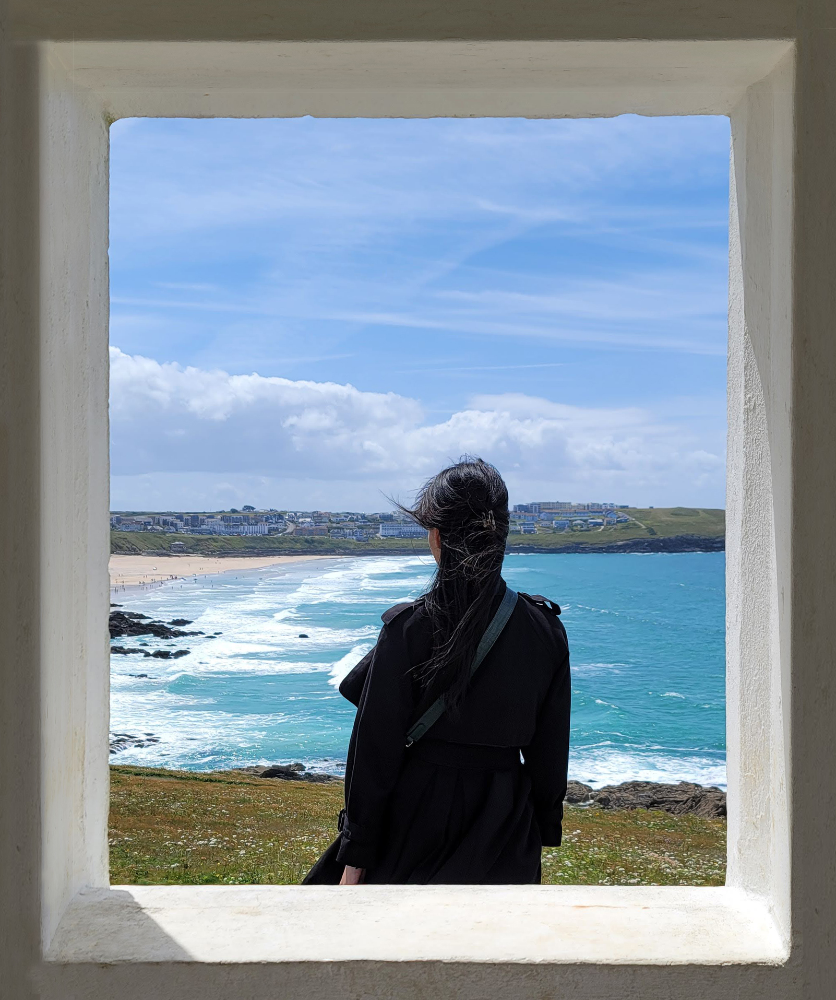
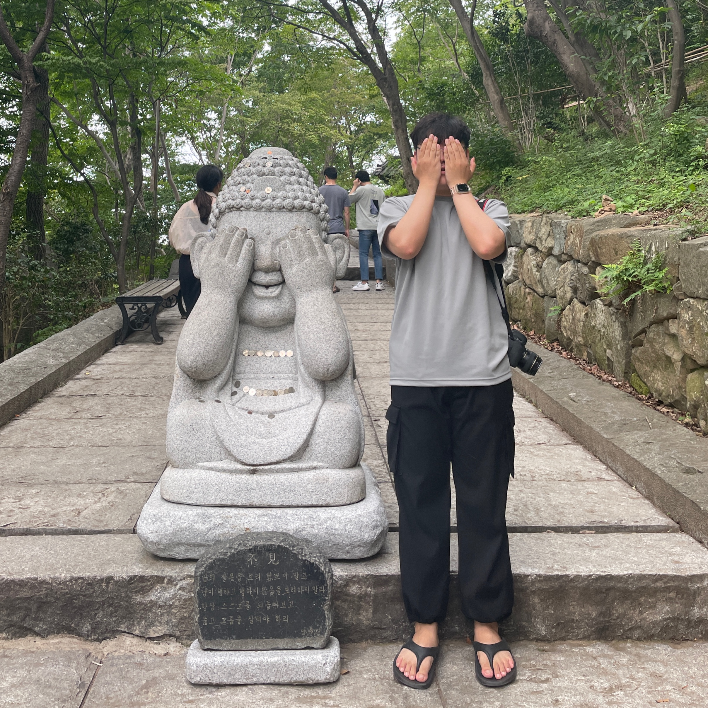
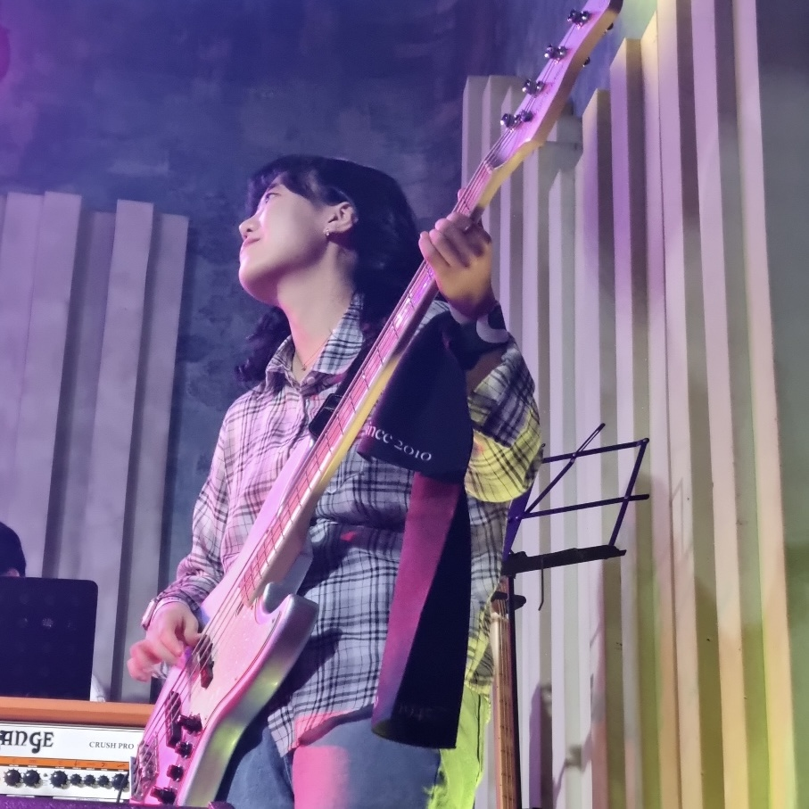
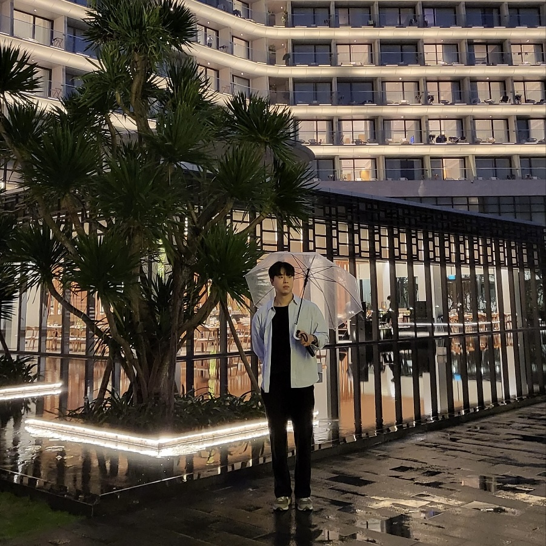

## LIKELION FRONT-END Bootcamp - UI Project

# UI Team Project 5 - 👑 킹왕짱 

### Nike Clone UI Project *Niking*
---

> 본 프로젝트는 '멋쟁이사자처럼 프론트엔드 부트캠프'의 일환으로 진행된 **비상업적 학습용 클론 UI 프로젝트**입니다. 나이키(NIKE) 공식 웹사이트의 일부 페이지를 클론하며 HTML, CSS, 그리고 반응형 디자인에 대한 이해를 심화하는 데 목적이 있습니다.


### 📁 프로젝트 개요
---
- **프로젝트 명:** Niking
- **진행 기간:** 2025.05.27 ~ 2025.06.05
- **진행 방식:** 팀/개인 별 클론 코딩 및 UI 구현
- **기여 방식:** GitHub 기반 협업 및 코드 리뷰
- **주요 목적:** 실무형 UI 구조 및 반응형 레이아웃 구현 역량 강화


### 🛠 기술 스택
---
| 카테고리       | 기술 스택 |
|----------------|-----------|
| 환경           |  |
| 마크업 및 스타일링 |   |
| 빌드           |  |
| 배포 및 운영   |  |
| 버전 관리      |   |
| 협업 도구      |  |

---

### 📂 프로젝트 구조
---
```plaintext
📦 ui-project-team5/
├── 📂 .github
├── 📂 node_modules
├── 📂 public
│   ├── 📂 favicon
│   └── 📂 font
├── 📂 src
│   ├── 📂 assets
│   │   ├── 📂 button  
│   │   ├── 📂 icon  
│   │   ├── 📂 images  
│   │   ├── 📂 logo  
│   │   ├── 📂 team-members
│   │   └── 📂 video  
│   ├── 📂 common      # 이미지 및 기타 정적 파일
│   ├── 📂 components  # 재사용 가능한 UI 컴포넌트의 HTML 파일
│   │   └── 📂 styles  # 각 HTML 파일 별 CSS 파일
│   ├── 📂 pages       # 각 페이지별 HTML 파일
│   │   └── 📂 styles  # 각 HTML 파일 별 CSS 파일
│   ├── 📂 scripts     # javascript 파일
│   ├── 📜 main.js
│   └── 📜 style.css
├── 📜 .gitignore
├── 📜 .prettierrc.cjs
├── 📜 index.html
├── 📜 package-lock.json
├── 📜 package.json
├── 📜 README.md
└── 📜 vite.config.js
```

### 👥 팀원 소개
---
| 이름 | 차지현 | 심우섭 | 정윤서 | 한우창 |
|------|--------|----------|--------|------|
| 프로필 이미지 |  |  |  |  |
| 역할 | Scrum Master | Team Member | Team Member | Team Member |
| 이메일 | j.cha1708@gmail.com | ooooseob@naver.com | jysjdt03@gmail.com | tkddbf9987@gmail.com |
| GitHub | [@chajiiiii](https://github.com/chajiiiii) | [@ooooseob](https://github.com/ooooseob) | [@yoonseo23](https://github.com/yoonseo23) | [@chan331](https://github.com/chan331) |

### 팀 역할 분배
---
| 이름 | 역할 |
|-----|-----|
| 차지현 | **팀장** / 위시리스트, 장바구니 구현 |
| 심우섭 | 매장찾기, 고객센터, 헤더/푸터 구현, 랜딩페이지 디자인 |
| 정윤서 | 메인페이지, 로그인/회원가입 페이지 구현 |
| 한우창 | 랜딩페이지, 제품리스트, 제품 상세페이지 구현 |

### 팀 회고
---
#### 차지현
[프로젝트 회고]
짧다면 짧고 길다면 긴 프로젝트 기간에 얼마나 만들어낼 수 있을지 궁금한 마음으로 시작했다. 일단 만들고 시맨틱, 접근성 등 나중에 세세하게 다시 하고자 했지만 역시나 막바지에는 다른 해야 할 게 너무 많아서 코드 리팩토링도 하지 못하고 끝내게 되어 너무 아쉽다. 그렇지만 여전히 좋은 경험이었고 우리 팀원분들도 모두 열의를 가지고 주도적으로 임해주셔서 정말 좋았다. 다음 프로젝트 때에는 이번에 깨달은 부분들을 보완하여 작업할 수 있도록 노력해야겠다.

- **심우섭** : 조장님 덕분에 협업하는데 어떻게 진행되는지 많이 알아갔습니다. 질문 하나하나 잘 봐줘서 좋았습니다! 다 살펴보지 않았었는데 위키같은 부분도 전부 채워져 있더라구요. 고생하셨습니다!

- **정윤서** : 21세기 최고의 팀장님 지현님💛 일정과 문서 정리도 깔끔하게 해주시고, 진행 흐름도 안정적으로 잘 이끌어주셔서 든든했습니다! 덕분에 배운 것도 많고, 편하게 집중해서 작업할 수 있었던 것 같습니다 :) 수고 많으셨습니다!

- **한우창** :  지현님은 스크럼 진행 시 팀원들의 의견을 잘 조율해 주며 논의를 이끌어주셨습니다. 맡은 일은 책임감을 가지고 꾸준히 해내셔서 팀 운영에 안정감을 더해주셔서 든든함을 느낄 수 있었습니다. 문서 작업이나 소통, 다른 사람을 챙기는 모습들도 팀워크에 긍정적이었습니다. 좋은 동료와 함께할 수 있어 힘이 되었습니다. 감사했습니다. 고생하셨어요!

#### 심우섭
[프로젝트 회고]
처음 협업으로 진행한 2주 프로젝트였는데 값진 시간이였다. 특히 소통 부분이 기억에 남았다. 매일 간단한 스크럼 회의를 통해 상황을 공유하고, 이슈가 생길 때 서로 도움을 받던 부분이 인상깊었다. 한 달 동안 배운 지식을 활용해서 프로젝트를 진행했더니 아직 멀었지만 그래도 한 발자국은 개발과 가까워지지 않았나 싶다. 많이 미숙했지만 잘 이끌어준 팀원들 감사합니다.

- **차지현** : 우섭님 디자인 잘 하시는 분이신지 저희 디자인, 레이아웃 관련 이야기 할 때 바로바로 눈에 보이게 도와주셔서 너무 좋았어요. 많이 도움이 되었습니다. 그리고 쉬는 시간 알려주셔서 감사해요 ㅎㅎ 앞으로도 잘 지내요

- **정윤서** : 금손 우섭님✨ 디자인 시안도 실시간으로 공유해주시고, 예쁘게 디자인해주신 덕분에 ‘나이킹’ 페이지가 저희 팀 분위기까지 잘 담긴 결과물이 된 것 같습니다ㅎㅎ 가끔 제가 헷갈리던 부분도 먼저 물어봐주셔서 도움 많이 됐습니다! 감사합니다 :)

- **한우창** : 우섭 님은 맡은 바를 끝까지 해내려는 끈기와 성실함으로 주위 동료들에게 긍정적인 동기부여를 해주셨습니다. 새로운 것을 배우려는 적극적인 자세도 인상 깊었고, 몸에 밴 듯한 배려와 친절함은 팀의 분위기를 부드럽게 만드는 데 큰 역할을 했습니다. 함께하면서 많은 것을 배우고 기분 좋게 협업할 수 있었습니다. 고생하셨어요!

#### 정윤서
[프로젝트 회고]
처음엔 널널할 줄 알았지만, 막바지에 갈수록 밤낮없이 협업하는 일이 생각보다 쉽지 않았다ㅠ 그래도 오랜만에 무언가에 몰입해 결과물을 만들어내니, ‘이래서 개발이 재밌다’는 말이 실감날 만큼 뿌듯했다.
이번 프로젝트를 통해 협업에서 유의할 점과 효율적인 방식, 그 이유까지 직접 부딪히며 배울 수 있었고, 실수도 많았지만 그만큼 성장할 수 있었던 값진 시간이었다.

- **차지현** : 윤서님 누가 시키지 않아도 굉장히 능동적으로 일을 찾아서 하시는 모습이 그 누구나 원하는 동료이자 신입사원이 아닌가 싶습니다. 여러 방면으로 도움 많이 주셔서 감사합니다. 함께 또 협업 할 수 있는 시간이 생기면 좋겠어요. 앞으로도 잘 지내요~

- **심우섭** : 윤서님 조장님과는 다른부분으로 프로젝트를 이끌어줬어요! 덕분에 진행하면서 생긴 문제점들이나 궁금한점들을 해결했습니다! 손이 늦어서 제 파트까지 도와주시구ㅜ 고생하셨습니다!!

- **한우창** : 윤서 님은 본인의 일이 마치면 팀을 먼저 생각하며, 도움이 필요한 곳을 찾아 적극적으로 지원하는 배려심과 능동적인 자세를 보여주셨습니다. 이러한 모습은 저에게 좋은 귀감이 되었고, 맡은 바 책임감 있는 모습 덕분에 안심하고 협업할 수 있었으며, 그 외 여러 면에서도 도움을 받아 의지할 수 있는 든든한 동료셨습니다. 고생하셨어요!

#### 한우창
[프로젝트 회고]
간만에 몰입할 수 있던 시간이었습니다. 제가 소통에 좀 더 적극적이었다면 하는 아쉬움이 있고, 시간에 쫓기듯 진행되어 부족했던 만큼 배울 점도 많았습니다. 팀원들과 함께해서 보람 있었고 다들 배려심이 깊으셨습니다. 그에 비례하게 다들 실력도 좋으셨습니다. 개인적으로 많은 것을 느낄 수 있었습니다. 팀원분들 덕분이라 생각합니다. 너무 고생 많으셨고 앞으로 함께 더 많은 성장을 이루고 싶습니다.

- **차지현** : 우창님 묵묵히 맡은 일을 열심히 하시는 모습이 너무 좋았습니다. 어려운 부분 있으면 도와주시려고 하고, 이견이 생길 때에는 대화를 통해 풀어나가는 모습을 보여주신거 같아서 인상 깊었습니다. 다음에도 또 함께해요~

- **심우섭** : 언제나 최대한 효율적으로 생각하시는 부분을 보고 배웠습니다. 응원해주는 부분이나 잘못된 부분을 지적해주는 점이 뒤돌아볼 수 있게 할 수 있어서 좋았습니다. 감사합니다!

- **정윤서** : Team. 킹왕짱의 만능 우창님💡 레이아웃도 전체적으로 꼼꼼하게 봐주시고 직접 수정해주신 덕분에 큰 도움 되었습니다! 이번 프로젝트하며 많이 배웠습니다ㅎㅎ 다음에 또 협업할 기회가 있으면 좋겠습니다:)

### 참고 자료
---
- [Nike 공식 홈페이지](https://www.nike.com/kr/)
- [MDN Web Docs](https://developer.mozilla.org/ko/)